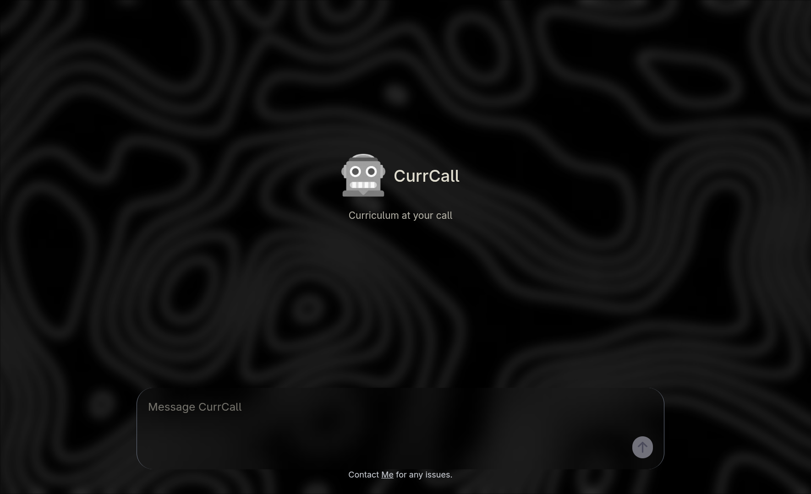

# CurrCall

CurrCall is an interactive chatbot designed for the Electronics and Communication Engineering (ECE) department at NIT Hamirpur. It helps students and faculty quickly access curriculum details, course information, and academic resources.

## Demo :
https://currcall.vercel.app/



## Features

- **Curriculum Overview**: Browse the ECE curriculum with ease.
- **Course Details**: Access information about courses including prerequisites, credits, and syllabi.
- **Academic Resources**: Quickly find important documents.
- **Interactive Chatbot**: Engage with a friendly chatbot for seamless navigation.

## Technologies Used

- **Stack**: NextJS,JS.
- **RAG**: Python based RAG : Langchain ,GEMINI .
- **Hosting**: Vercel.
- **API** : FastAPI.

## Installation

To run CurrCall locally:

1. Clone the repository:
   ```bash
   git clone https://github.com/seika-afk/CurrCall.git
2. Go To currcall folder
3. Enter the following code :
```bash
   npm run dev
```
4. The Site will start on "localhost:3000"

## Contributing
Contributions are welcome! Please fork the repository and create a pull request for any new features or improvements.
